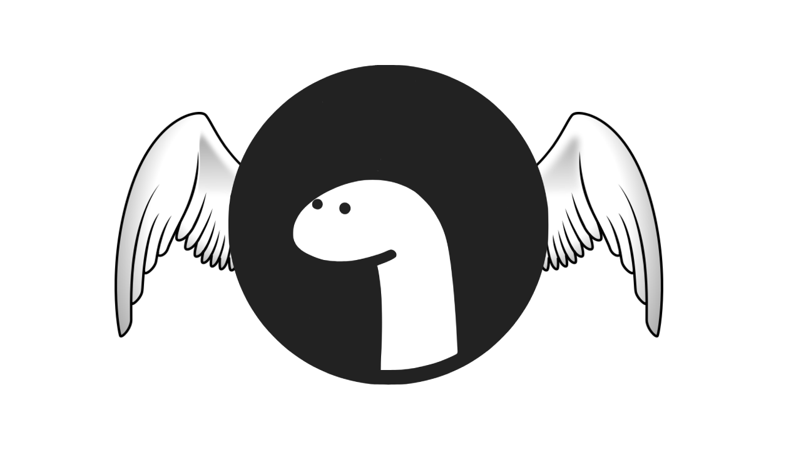

<p align="center">



</p>

[](https://github.com/divy-work/autopilot-deno/stargazers)
[](https://github.com/divy-work/autopilot-deno/issues)
[](https://github.com/divy-work/autopilot-deno/actions)


AutoPilot is a simple cross-platform desktop automation library for Deno.

Get in touch:
  * Discord: undefined_void#8575

### Features

- [x] Keyboard
  - [x] Type a string using `.type`
  - [x] Tap a key using `.tap`
  - [x] Toggle key using `.toggleKey`

- [x] Mouse
  - [x] Simulate mouse movement using `.moveMouse`
  - [x] Get mouse position using `.mousePosition`
  - [x] Get mouse position pixel color `.pixelColor`

- [x] Screen
  - [x] Capture screen using `.screenshot`
  - [x] Get screen size using `.screenSize`
  - [x] Check if point out of bounds using `.pointVisible`

- [x] Alert
  - [x] Native popup using `.alert`

### Documentation

Detailed documentation of the API is available at:

https://autopilot.divy.work

### Requirements

#### Linux
```sh
sudo apt-get update
sudo apt-get install libxtst-dev cmake libc-dev libx11-dev libxcb1-dev
```

### Usage

Running your Deno script with AutoPilot requires some flags
```sh
deno run --unstable --allow-net --allow-plugin --allow-env --allow-read --allow-write file.ts
```

**NOTE**: Prebuilt binaries are automatically downloaded the first time you import Autopilot in your project and are cached.

```typescript
import AutoPilot from 'https://raw.githubusercontent.com/divy-work/autopilot-deno/master/mod.ts';

// create a new AutoPilot instance.
var pilot = new AutoPilot();

// type a string
pilot.type("Yay! This works");

// alert something
pilot.alert("This is a alert");

// get screen size
pilot.screenSize();

// move mouse
pilot.moveMouse(200, 400);

// take a full-screen screenshot
pilot.screenshot("screenshot.png");
```
