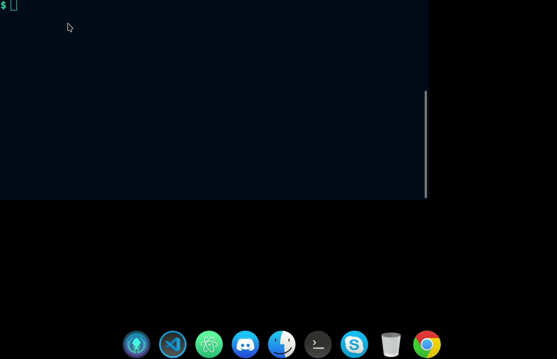
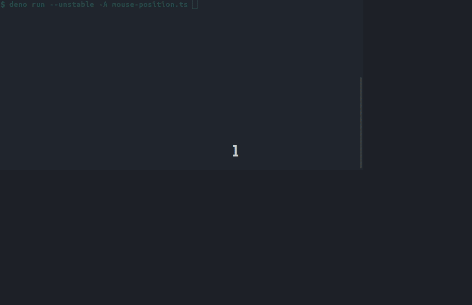
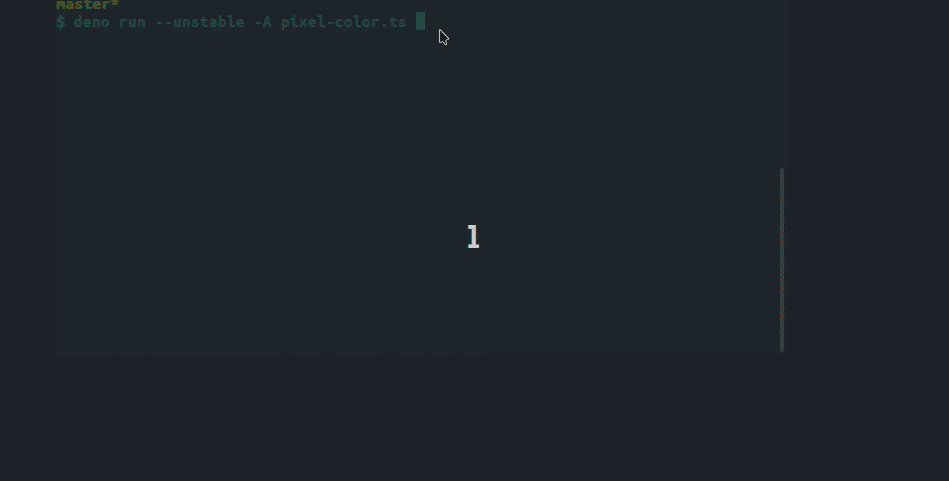
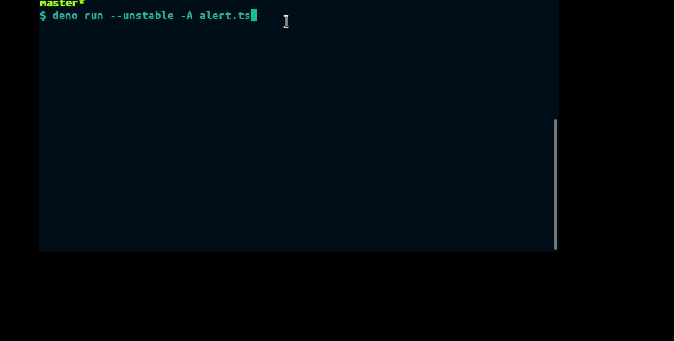

## Introduction

> Warning: These are for the latest version of Autopilot


AutoPilot is a simple cross-platform desktop automation library for Deno.

## Requirements

### Linux

```sh
sudo apt-get install libxtst-dev cmake libc-dev libx11-dev libxcb1-dev
```

## Quick start

Simple import `Autopilot` from Github raw cdn.

```typescript
import AutoPilot from 'https://raw.githubusercontent.com/divy-work/autopilot-deno/master/mod.ts';
```

> Info: AutoPilot automatically installs prebuilt binaries for the first time and caches it for future runs.

## Usage

The `AutoPilot` constructors provides the API for interacting with the rust bindings.

```typescript
const pilot = new AutoPilot();
```

See the list of available methods inside `Autopilot` constructor.

## API

### Keyboard

#### .type

Simulates keyboard input to type the given string.

Example:
```typescript
pilot.type("Hello, World!");
```



#### .tap

Simulates a key tap for the given key.

Example:
```typescript
pilot.tap("enter");
```

#### .toggleKey

Toggle the given key.


Arguments:

* `key` - string - The key to be toggled.
* `down` - boolean - Whether to press down or not.

Example:
```typescript
pilot.tap("enter", true);
```

### Mouse

#### .moveMouse

Move the mouse cursor to the given position.

Arguments:

* `x` - number - abcissa of mouse position
* `y` - number - ordinate of mouse position

Example:
```typescript
pilot.moveMouse(300, 500);
```


#### .mousePosition

Get current mouse position.

Returns type `Point`.

```typescript
interface Point {
    x: number,
    y: number
}
```

Example:
```typescript
pilot.mousePosition();
```



#### .pixelColor

Get current mouse pixel color.

Returns type `RGBA`.

```typescript
interface RGBA {
    r: number,
    g: number,
    b: number,
    a: number
}
```

Example:
```typescript
pilot.pixelColor();
```




#### .click

Simulate a click

Argument:

```typescript
type ClickArguments = "right" | "left" | "middle";
```

Example:
```typescript
pilot.click("right");
```

#### .scroll

Simulate a mouse scroll (5 ticks).

Argument:
```typescript
type ScrollArguments = "up" | "down";
```

Example:
```typescript
pilot.scroll("up");
```

### Screen

#### .screenSize

Get the screen size.

Returns:
```typescript
interface ScreenSize {
  height: number,
  width: number
}
```

Example:
```typescript
pilot.screenSize();
```

#### .screenshot

Simulate a screengrab and output an image.

Argument: Output image name

Example:
```typescript
pilot.screenshot("screenshot.png");
```

#### .screenScale

Get the number of pixels in a point

Returns: `number`

Example:
```typescript
pilot.screenScale(); // mostly outputs 1
```

#### .pointVisible

Check whether point is out of screen bounds or not.

Arguments:

* `x` - number - abcissa of point
* `y` - number - ordinate of point

Example:
```typescript
pilot.pointVisible(100, 35);
```

### Alert

### .alert

Trigger a native popup.

Arguments:
```typescript
type Alert = string | AlertOptions;
// where
interface AlertOptions {
  title?: string;
  msg: string;
}
```

Example:
```typescript
pilot.alert("alert without title");
// or
pilot.alert({
  title: "Oops! This is an alert!"
  msg: "Something definetly went wrong!"
})
```




### Others

#### .getMonitors

Get the number of monitors.

Returns: `Promise<number>`

Example:
```typescript
pilot.getMonitors();
```

### Building from source

> Warning: This requires Rust and Cargo setup in your machine.

Clone the github repo
```sh
git clone https://github.com/divy-work/autopilot-deno
cd autopilot
cargo build
```

Running `cargo build` might take several minutes to build for the first time.

Now, you can test the current builds using the `DEV` env variable

```sh
DEV=* deno run --unstable --allow-* examples/sine.ts
```

### OS Support

* Ubuntu - Full Support
* MacOS - Supported but Not tested
* Windows - Supported but Not tested

If you find any difficulty while building from source or using this module, please open a issue or PR stating your issue.
